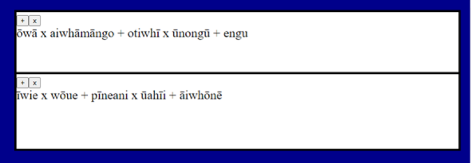

# Tākaro Kēmu: [Kupu Māori](https://greybeetle213.github.io/non-words/maori-index.html) | [Kupu Pākehā](https://greybeetle213.github.io/non-words/index.html) 

## NGĀ TURE O TE KĒMU

Ka tākorotia ēnei kēmu i te reo Pākeha, i te reo Māori rānei.

I ngā reo e rua, i hangaia ētahi kupu (1700 kupu i te reo Māori, 6100 i te reo Pākeha), ā i pātaitia ētahi tangata i māia ai i te reo, he aha te pai, te kore rānei kia tū ēnei kupu hei kupu o te reo tūturu. Hei tauira, ko te kupu ‘otiko’ he kupu āhua Māori atu i te kupu ‘iengāo’.

Kua tatau tātou – he aha te pai (te kino rānei) o ēnei kupu katoa.  Ki ia kupu tētahi nama.
Ko te mea nui mō ēnei kēmu: mehemea he tino pai te kupu - he pai ia ki te nuinga o ngā tangata - he tau tōrunga te tatau.  Mehemea he tino kino, he tau tōraro te tatau.  Ko te tatau o te kupu toharite: 0.

Ānei ētahi tauira o ētahi kupu tino kino, tino pai, ā ētahi kupu toharite, i ia reo.

### Ko te reo Māori:

-  	Kino:   *aoku* (-173), *upio* (-135)

-   Toharite:  *eha* (0), *wīpōkē* (0)

-   Pai: *kīore* (253), *ngawhāniti* (205)

### Ko te reo Pākehā

-   Kino:   *gygenard* (-159)

-   Toharite: *wamap* (0)

-   Pai:  *unappeach* (245)

Kua kitea, he tino tata ngā kupu tino pai ki tētahi kupu tūturu.

Ko te mea nui o te kēmu:  me ata whakaaro koe - he aha te pai o ngā kupu?  He nama tōraro te kupu, he nama tōrunga rānei?

E rua ngā kaitākaro.   Me hanga whārite ia kaitākaro.

1.     Kei te puta 10 kupu ki te māui.

2.     Ka whiriwhiri te kaitākaro tuatahi i tētahi kupu, ā kōwhiri ia i te ‘+” i tōna matapihi, ki te timata o tōna whārite. 

3.     Ka whiriwhiri te kaitākaro tuarua i tāna kupu tuatahi.

4.     Ka whiriwhiri te kaitākaro tuatahi i te kupu tuarua.  Kātahi ka whiriwhiri ia, mehemea ka whakareatia, ka tāpiria rānei.

5.     Haere tonu.  Me whiriwhiritia ngā kupu tēkau katoa.  E 5 kup ki ia kaitākaro.

 

## ĒTAHI TUWHIRI PĀNGARAU

-        Mehemea ka whakareatia tētahi tau tōrunga ki tētahi tau tōraro – he tau tōraro te otinga!

-        Mehemea ka whakareatia tētahi tau tōraro ki tētahi tau tōraro – he tau tōrunga te otinga!

-        Ka whakaotiotia te whakarea i mua i te tāpiri.

Mehemea ka hiahiatia ētahi ture ngāwari - ka taea te 'x' e waihotia.   Ka tākaro ngā kaitākaro e rua ki te '+' anake.

       
## HE TAUIRA:

Ānei tētahi tauira, o ngā kupu i whiriwhiritia e te kaitākaro tuatahi (ki runga), rāua ko te kaitākaro tuarua (ki raro).  

Ka e rima kupu ki a ia kaitākaro, ka kitea te tatau.

Ko kaitākaro 2 te toa.   Ka eke ōna paneke.   Ka eke tētahi paneke ki '5', ka oti te kēmu.

## HE AHA AI I HANGAIA NGĀ KUPU I TĒNEI KEMU?
 
He hua ngā kupu i ngā hinonga e rua.

Ko ngā kupu Pākehā i tēnei hinonga: [Phonotactic and Morphological Effects in the Acceptability of Pseudowords](http://www.phon.ox.ac.uk/jpierrehumbert/publications/pseudowords_mtlc_share.pdf)

Ko ngā kupu Māori i tēnei hinonga. [Non-Māori-speaking New Zealanders have a Māori proto-lexicon](https://www.nature.com/articles/s41598-020-78810-4)

Ko ngā hinonga e rua, he hinonga **mātauranga wetero**.

## HE AHA TE ‘MĀTAURANGA WETEREO’?
 

Ko te mātauranga wetereo (linguistics) te ako o ‘ngā ture me te hanganga o te reo’.

He nui ngā kaupapa e ākona nei.   Ānei ētahi pātai, i pātaitia ai e ngā tohunga wetero.

-       Pēhea te akona o te reo e ngā tamariki?

-       He aha ngā ture me ngā hanganga rerekē i ngā reo katoa o te ao?

-       He aha ngā whakatakotoranga o ngā reo?

-        He aha te mohiotanga i te hinengaro o te kaikōrero o te reo?

-       Ka whakaaweawe te reo i te tiro ā tangata ki tōna ake ao?

-        Kei te haere ngā reo ki hea? Pēhea ngā whakarerekē?

E hangaia ngā kupu i tēnei kēmu, kia whakautungia ētahi pātai e pā ana te **ororeo**.

## HE AHA TE ‘OROREO?’
 
Ko te kupu ororeo, te kupu Māori mō tētahi momo wetereo: ko te ‘Phonetics/Phonology’

He nui te momo ororeo.  Ānei ētahi tauira:

- **Mātauranga whakahua**: te ako o te ororeo whakaputa me te ororeo whakarongo (articulatory and auditory phonetics).  He tauira: he rerekē te kaha o te hau o te oro  ‘t’ i te reo Māori, i te reo Pākehā.  He rerekē hoki te mita o ia iwi, o ia whenua, o ia kaikōrero hōki.

- **Ororeo ture** (categorical phonology):  te ako o ngā ture o ngā oro - pēhea te hangaia o ngā kupu i ngā oro?   He tauria – kāore e taea te ‘t’ te tū i te whakamutunga o ngā kupu Māori.   Kāore e taea te ‘ng’ te tū i te timatanga o ngā kupu Pākeha. Ētahi pātai o tēnei momo orero: he aha ngā ture rerekē i ngā reo o te ao?  He aha ngā ture, e tū rā i ngā reo katoa?

- **Ororeo tūponotanga** (probabilistic phonology):  Mēna ka mōhio koe i ngā kupu i tētahi reo, he nui ngā tauira i taua kupu i tō roro.  He aha ngā āhuatanga auau i te reo, he aha ngā āhuatanga whakaonge?  Ka noho ēnei tūponotanga i te reo, ā i ngā hinengaro o nga kaikōrero o te reo hōki.   Ko te ororeo tūponotanga te ako o ēnei āhuatanga i ngā reo, ā te ako o te mōhiotanga o aua āhuatanga i ngā kaikōrero.

He tauira – ānei ngā ohokati i te tīmatanga o ngā kūoro o kupu o te reo Māori.  I te tuaka pae - kei hea i te kupu te kūoro?  Mēnā te kūoro tuatahi, i tuhia '1', mēnā tuarua - 2...  I te tuaka pou - e hia ngā kupu?

(I te hinonga: [Gradient Māori Phonotactics](https://peterracz.files.wordpress.com/2017/02/gradient_maori_phonotactics_te_reo.pdf))

Ka kitea, i te kūoro tuatahi o ngā kupu Māori, he nui ake kuōro i timata ai ki te ‘m’, i te ‘r’.  Engari, i ngā kūoro tuarua, he nui ake ngā kuōre i timata ai ki te ‘r’ i te ‘m’.

Nō reira, mehemea ka hanga au i ētahi kupu hou, he pai ake te ‘mire’ i te ‘rime’, pea.

Ka noho pēnei āhuatanga o te reo i tō hinengaro!

 
## HE AHA TĒTAHI TAUIRA O TE RANGAHAU KI ĒNEI KUPU?
 
Ko te take nui, i hangaia ai mātou i ngā kupu Māori, kia whakautungia tēnei pātai:

Mehemea kei te noho tētahi tangata i Aotearoa, a kāore taua tangata e  ako i te reo Māori,  kāore taua tangata e korero i te reo Māori - he aha te mōhiotanga ororeo tūponotanga o tēnei tangata?    Kei te rongo ngā tangata o Aotearoa katoa i te reo Māori i ētahi wā.   I ngā mihimihi, ngā waiata, ngā karakia hoki. Kāore i orotaua, engara kua mahara ngā kupu e rātou.   

He nui ngā momo mōhio i te kupu.   Ka mōhio koutou i ngā kupu nui.  Kei te mohio koutou i te tikanga o ēnei kupu hoki.  Engari, he momo mōhiotanga i mua i tēnei mōhiotanga.  Ka rongo tētahi pēpē i tētahi kupu, ka mōhio ia pea ki te āhua o taua kupu, engari kāore anō kia mohio ki te tikanga o taua kupu.  Ko te ingoa o tēnei momo mōhiotanga ko te **Puna Kupu Tuatahi** (i te reo Pākehā, te **proto-lexicon**).

Ko tō mātou pātai: He aha te nui o te ‘punu kupu tuatahi’ o ngā tāngata o Aotearoa, ngā tangata kore mōhio i te reo Māori?   He nui tō mātou ohorere ki te whakautu.   He tino nui te puna kupu tuatahi o ēnei tāngata!   I tō rātou puna kupu tuatahi, he orite ō rātou whakaaro e pā ana te pai o ngā kupu i te kēmu nei, ki ngā whakaaro o ngā tangata kōrero Māori. 

Ka noho ngā kupu Māori i te puna kupu tuatahi o ngā tangata i Aotearoa, nō reira, he tino nui tō rātou mōhiotanga, e pā ana te ororeo tūpuonontanga o te reo.

[Ānei ngā whakanikoniko]((https://www.nature.com/articles/s41598-020-78810-4)

## I TE AKOMANGA

Ānei ētahi pātai, kia wānangatia i te akomanga.
1.	Wānangatia:  he aha ngā āhuatanga o ngā kupu tino pai ki a koutou?  He aha ngā āhuatanga o ngā kupu tino kino?   He aha ētahi rerekē i kitea ai o te reo Māori i te reo Pākeha?

2.	 Ānei ētahi meka e pā ana ngā reo.   He meka ororeo ture, ororeo tūponontanga,  mātauranga whakahua, rānei?

 -	Hāunga te ‘m’ me te ‘n’: i te reo Hapanihi, e kore ngā orokati e āhei te tū ki te whakamutunga o te kūoro. 
 
 -	He tino rerekē te oro te kupu Pākehā ‘fish’ i Aotearoa, i Ahitereiria.
 
 -	Kāore i te pai ki ngā kaikōrero o te reo Pākehā, mēna ka tino tata i tētahi kupu e rua ngā oro ‘hīhi’.  (‘s’, ‘sh’, “ch” rānei)
 
3.	Whakaarotia o ētahi reo, i rangona ai e koutou, engari kāore e taea e koutou te kōrero.   Ki ō koutou whakaaro, ka uaua, ka ngāwari rānei tēnei kēmu i pērā reo?  He aha ai?

4.	He aha ētahi meka anō e mōhiotia nā e koutou, e pā ana ngā oro o ngā reo o te ao?   Mō ia meka, wānangatia:he meka ohoreo ture, ohoreo tūponotanga, ohoreo whakahua rānei?

## KO WAI MĀTOU?
 
### Te kaituhi o te whārangi ipurangi nei
 
I tuhia tēnei whārangi e Jen Hay.  He ahorangi mātauranga wetereo ia.   Ko Jen te Kaiwhakahaere Matua o Te Kāhui Roro Reo, tētahi rōpū rangahau i Te Whare Wānanga o Waitaha. He maha ana mahi rangahau mō ngā āhuatanga o ngā reo: te rerekē haere, me te wetewete kupu.   Ko ngāti Pākehā te iwi.  He ākonga ia o te reo Māori, ā kua tuhia tēnei rauemi hei aromatawai mō tōna akoranga Māori i te Whare Wananga o Waitaha.  Ko Komene Kururangi te kaiako.

### Ngā kaitito o te kēmu
I titoa te kēmu e Jen rāua ko tānā tama – Bob Haywood.  13 ōna tau.   

I tuhia te waehere o te pūmanawa tautono e Bob.

### Ngā kairangahau
 
I hangaia ngā kupu mō te rangahau o ēnei kairangahau:

-         Professor Jen Hay, University of Canterbury

-         Professor Jeanette King, University of Canterbury

-         Assistant Professor Simon Todd (Ngāi Tahu), University of California at Santa Barbara

-         Dr Yoon Mi Oh, Ajou University

-         Dr Clay Beckner, University of Warwick

-         Professor Janet Pierrehumbert, University of Oxford

-         Dr Jeremy Needle, University of Toronto

-         Dr Peter Racz, Central European University

-         Dr Forrest Panther (Te Rarawa), University of Canterbury

-         Dr Wakayo Mattingley, University of Canterbury

-         Dr Peter Keegan (Waikato-Maniapoto),   University of Auckland

